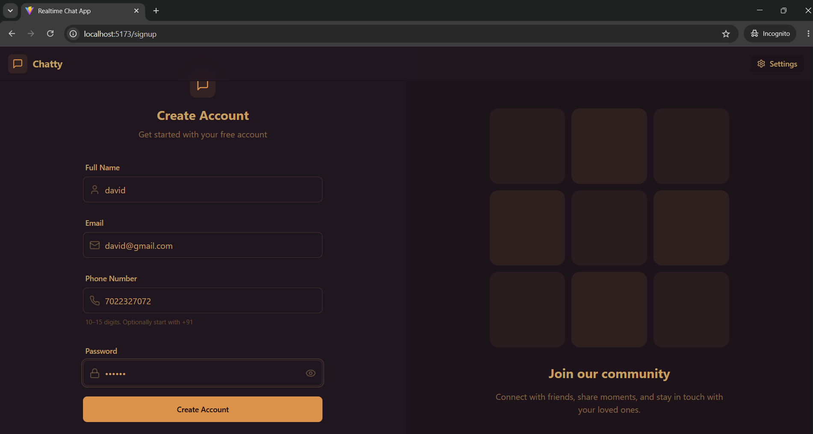
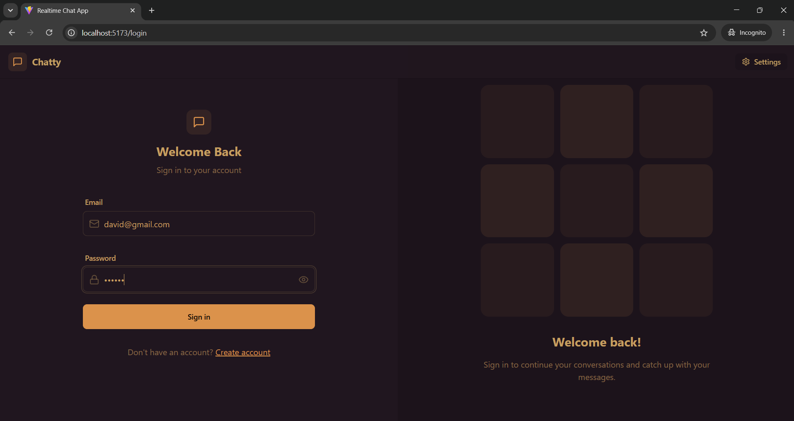
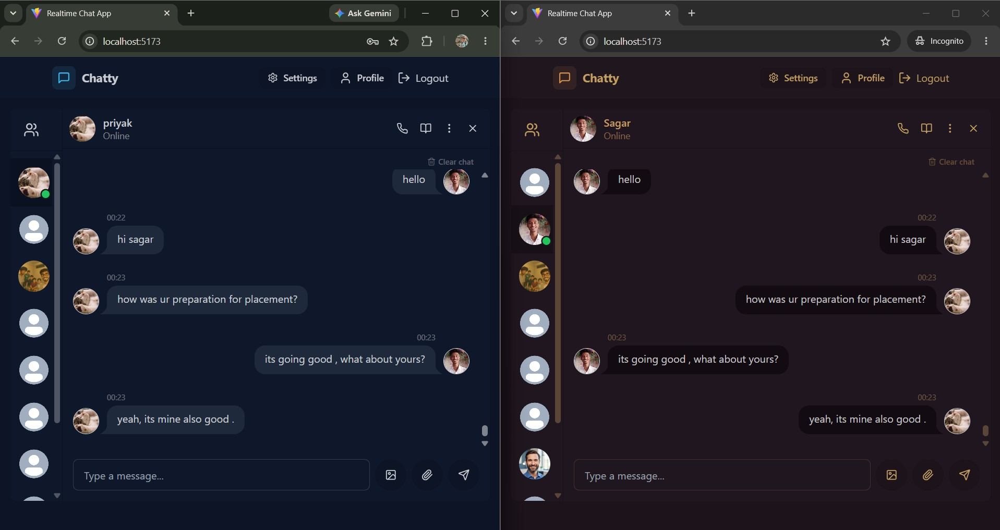
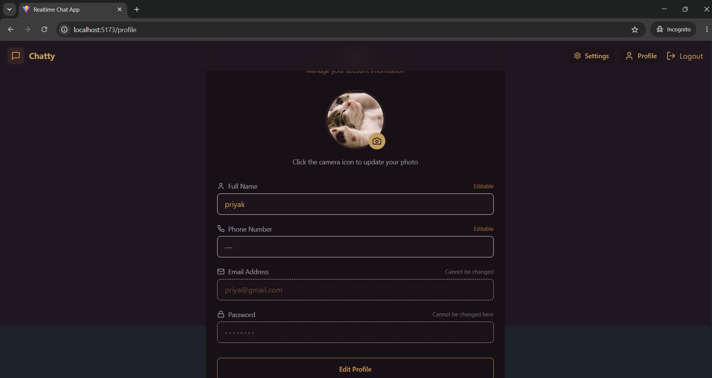
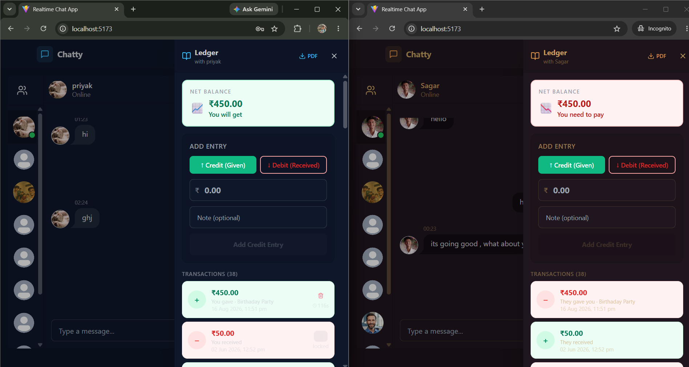

# ✨ Full Stack Realtime Chat App with Ledger Integration

A modern **full-stack real-time chat application** enhanced with a **ledger-based communication feature**. The application provides secure authentication, real-time messaging, online user status, file sharing, profile management, and an integrated ledger interface.

The project is built using the **MERN stack**, Socket.IO, Zustand, Tailwind CSS, and DaisyUI, with Cloudinary used for file and image uploads.

---

## 🚀 Features

* 💬 **Real-time messaging** using Socket.IO
* 🟢 **Online/Offline user status**
* 🔐 **Authentication and Authorization** using JWT
* 📎 **File and image sharing**
* 👤 **User profile management**
* 🎨 **Modern responsive UI**
* 🌙 **Theme support**
* ⚡ **Fast real-time communication**
* 🗄️ **MongoDB database** using Mongoose
* ☁️ **Cloudinary integration** for file and image uploads
* 🧾 **Ledger-based communication feature**
* 🔄 **Real-time updates using Socket.IO**
* 🛡️ **Server-side and client-side error handling**
* 📦 **REST API architecture**
* 🔧 **Postman API collection for backend testing**

---

## 🛠️ Tech Stack

### Frontend

* React
* Vite
* Zustand
* Tailwind CSS
* DaisyUI
* Axios
* Socket.IO Client

### Backend

* Node.js
* Express.js
* MongoDB
* Mongoose
* Socket.IO
* JWT
* Cloudinary

### Development & Testing

* Git & GitHub
* Postman
* Nodemon
* npm

---

## 🏗️ System Architecture

```text
                    ┌─────────────────────┐
                    │        User         │
                    │     Web Browser     │
                    └──────────┬──────────┘
                               │
                               ▼
                    ┌─────────────────────┐
                    │      Frontend       │
                    │ React + Vite        │
                    │ Zustand              │
                    │ Tailwind + DaisyUI   │
                    └──────────┬──────────┘
                               │
                    HTTP / Socket.IO
                               │
                               ▼
                    ┌─────────────────────┐
                    │       Backend       │
                    │ Node.js + Express    │
                    │ Socket.IO            │
                    └──────┬────────┬─────┘
                           │        │
                 ┌─────────┘        └──────────┐
                 ▼                             ▼
        ┌─────────────────┐           ┌─────────────────┐
        │     MongoDB     │           │    Cloudinary   │
        │ Users & Messages│           │ Files & Images  │
        └─────────────────┘           └─────────────────┘
                           │
                           ▼
                  ┌─────────────────┐
                  │ Ledger Feature  │
                  │ Communication   │
                  └─────────────────┘
```

---

## 📂 Project Structure

```text
fullstack-real-time-chat-app/
│
├── .postman/
│
├── backend/
│   ├── src/
│   ├── package.json
│   └── package-lock.json
│
├── frontend/
│   ├── public/
│   ├── src/
│   ├── package.json
│   └── package-lock.json
│
├── postman/
│
├── screen_shots/
│   ├── chatting.jpeg
│   ├── ledger.png
│   ├── login_page.png
│   ├── profile.png
│   ├── signup_page.png
│   └── screenshots
│
├── .gitignore
├── LICENSE
├── README.md
├── package.json
└── package-lock.json
```

---

# 🔐 Authentication & Authorization

The application uses **JWT (JSON Web Token)** for secure authentication and authorization.

The authentication flow is:

```text
User
 │
 ▼
Login / Signup
 │
 ▼
Backend API
 │
 ▼
Validate Credentials
 │
 ▼
Generate JWT
 │
 ▼
Authenticated User
```

Protected routes ensure that only authenticated users can access authorized resources.

---

# 💬 Real-Time Messaging

The application uses **Socket.IO** for real-time communication.

When a user sends a message:

```text
User A
  │
  ▼
React Frontend
  │
  ▼
Socket.IO
  │
  ▼
Node.js Backend
  │
  ├──────────────► MongoDB
  │
  ▼
Socket.IO
  │
  ▼
User B
```

Messages are delivered in real time without requiring the user to refresh the page.

---

# 🟢 Online User Status

Socket.IO is also used to maintain real-time user presence.

The application can identify when users:

* Come online
* Go offline
* Connect to the application
* Disconnect from the application

This allows the chat interface to display the current user status dynamically.

---

# 📎 File & Image Sharing

The application supports sharing files and images through the chat system.

The upload flow is:

```text
User
 │
 ▼
Select File
 │
 ▼
React Frontend
 │
 ▼
Express Backend
 │
 ▼
Cloudinary
 │
 ▼
File URL
 │
 ▼
Message / Database
```

Cloudinary is used to store uploaded files and images instead of storing large files directly on the application server.

---

# 🧾 Ledger Integration

The `ledger` branch extends the original real-time chat application with a **ledger-based communication feature**.

The ledger interface provides an additional layer for recording and managing communication-related information within the application.

The ledger functionality is integrated with the existing:

* React frontend
* Node.js backend
* MongoDB database
* Real-time Socket.IO communication

---

# 🗄️ Database

The project uses **MongoDB** with **Mongoose**.

MongoDB is used to store application data such as:

* User information
* User profiles
* Messages
* Conversations
* Authentication-related data
* Ledger-related information

Mongoose provides schemas and models for interacting with MongoDB from the Node.js backend.

---

# 📸 Screenshots

## 🔐 Login Page



---

## 📝 Signup Page



---

## 💬 Real-Time Chat



---

## 👤 Profile Page



---

## 🧾 Ledger Interface



---

# ⚙️ Installation

## 1️⃣ Clone the Repository

```bash
git clone https://github.com/sagarkukkugol/fullstack-real-time-chat-app.git
```

Navigate into the project:

```bash
cd fullstack-real-time-chat-app
```

If you want to work specifically with the ledger branch:

```bash
git checkout ledger
```

---

# 🔧 Backend Setup

Navigate to the backend:

```bash
cd backend
```

Install dependencies:

```bash
npm install
```

Create a `.env` file inside the `backend` folder.

Add:

```env
MONGODB_URI=your_mongodb_connection_string
PORT=5001
JWT_SECRET=your_jwt_secret

CLOUDINARY_CLOUD_NAME=your_cloudinary_cloud_name
CLOUDINARY_API_KEY=your_cloudinary_api_key
CLOUDINARY_API_SECRET=your_cloudinary_api_secret

NODE_ENV=development
```

Start the backend development server:

```bash
npm run dev
```

The backend will run on:

```text
http://localhost:5001
```

---

# 🎨 Frontend Setup

Open a second terminal.

Navigate to the frontend:

```bash
cd frontend
```

Install dependencies:

```bash
npm install
```

Start the development server:

```bash
npm run dev
```

Vite will provide the frontend URL, normally:

```text
http://localhost:5173
```

Open the URL in your browser.

---

# 🔐 Environment Variables

Never commit sensitive credentials to GitHub.

The backend `.env` file should contain:

```env
MONGODB_URI=your_mongodb_connection_string
PORT=5001
JWT_SECRET=your_jwt_secret

CLOUDINARY_CLOUD_NAME=your_cloudinary_cloud_name
CLOUDINARY_API_KEY=your_cloudinary_api_key
CLOUDINARY_API_SECRET=your_cloudinary_api_secret

NODE_ENV=development
```

Make sure `.env` is included in `.gitignore`.

---

# 🧪 API Testing

The project includes Postman-related files for testing backend APIs.

You can use Postman to test:

* Authentication APIs
* User APIs
* Messaging APIs
* File upload APIs
* Other backend endpoints

The Postman collection can be found in the project's `postman/` directory.

---

# 🏗️ Build the Application

To create a production build:

```bash
npm run build
```

---

# ▶️ Start the Application

To start the production application:

```bash
npm start
```

For development with automatic server restarting:

```bash
npm run dev
```

---

# 🔄 Development Workflow

Run the backend and frontend separately during development.

### Terminal 1 — Backend

```bash
cd backend
npm install
npm run dev
```

### Terminal 2 — Frontend

```bash
cd frontend
npm install
npm run dev
```

Then open the frontend URL provided by Vite.

---

# 🛡️ Error Handling

The application implements error handling on both:

### Client Side

* Invalid inputs
* Authentication errors
* Upload errors
* API errors
* Connection errors

### Server Side

* Invalid requests
* Authentication failures
* Database errors
* File upload errors
* API errors

This improves application reliability and provides better feedback to users.

---

# 🚀 Future Improvements

Possible future enhancements include:

* 👥 Group conversations
* 📞 Voice calling
* 🎥 Video calling
* 😀 Message reactions
* 🔔 Push notifications
* 📨 Message read receipts
* 🔎 Advanced message search
* 📱 Improved mobile responsiveness
* 🤖 AI-powered communication assistance
* 📊 Advanced ledger analytics
* 🔗 Enhanced ledger integration

---

# 👨‍💻 Author

**Sagar Sanju Kukkugol**

Full Stack Developer

**Technologies:** React | Node.js | Express.js | MongoDB | Socket.IO | Cloudinary

---

# 📄 License

This project is licensed under the **MIT License**.

See the `LICENSE` file for more information.
